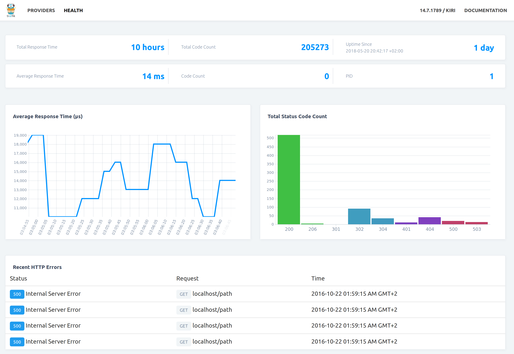

<p align="center">

</p>

[](https://semaphoreci.com/containous/traefik)
[](https://docs.traefik.io)
[](http://goreportcard.com/report/containous/traefik)
[](https://microbadger.com/images/traefik)
[](https://github.com/containous/traefik/blob/master/LICENSE.md)
[](https://traefik.herokuapp.com)
[](https://twitter.com/intent/follow?screen_name=traefikproxy)


Træfik (pronounced like [traffic](https://speak-ipa.bearbin.net/speak.cgi?speak=%CB%88tr%C3%A6f%C9%AAk)) is a modern HTTP reverse proxy and load balancer made to deploy microservices with ease.
It supports several backends ([Docker](https://www.docker.com/), [Swarm](https://docs.docker.com/swarm), [Kubernetes](http://kubernetes.io), [Marathon](https://mesosphere.github.io/marathon/), [Mesos](https://github.com/apache/mesos), [Consul](https://www.consul.io/), [Etcd](https://coreos.com/etcd/), [Zookeeper](https://zookeeper.apache.org), [BoltDB](https://github.com/boltdb/bolt), [Eureka](https://github.com/Netflix/eureka), [Amazon DynamoDB](https://aws.amazon.com/dynamodb/), Rest API, file...) to manage its configuration automatically and dynamically.

## Overview

Imagine that you have deployed a bunch of microservices on your infrastructure. You probably used a service registry (like etcd or consul) and/or an orchestrator (swarm, Mesos/Marathon) to manage all these services.
If you want your users to access some of your microservices from the Internet, you will have to use a reverse proxy and configure it using virtual hosts or prefix paths:

- domain `api.domain.com` will point the microservice `api` in your private network
- path `domain.com/web` will point the microservice `web` in your private network
- domain `backoffice.domain.com` will point the microservices `backoffice` in your private network, load-balancing between your multiple instances

But a microservices architecture is dynamic... Services are added, removed, killed or upgraded often, eventually several times a day.

Traditional reverse-proxies are not natively dynamic. You can't change their configuration and hot-reload easily.

Here enters Træfik.


Træfik can listen to your service registry/orchestrator API, and knows each time a microservice is added, removed, killed or upgraded, and can generate its configuration automatically.
Routes to your services will be created instantly.

Run it and forget it!
  
  


## Features

- [It's fast](http://docs.traefik.io/benchmarks)
- No dependency hell, single binary made with go
- Rest API
- Multiple backends supported: Docker, Swarm, Kubernetes, Marathon, Mesos, Consul, Etcd, and more to come
- Watchers for backends, can listen for changes in backends to apply a new configuration automatically
- Hot-reloading of configuration. No need to restart the process
- Graceful shutdown http connections
- Circuit breakers on backends
- Round Robin, rebalancer load-balancers
- Rest Metrics
- [Tiny](https://microbadger.com/images/traefik) [official](https://hub.docker.com/r/_/traefik/) docker image included
- SSL backends support
- SSL frontend support (with SNI)
- Clean AngularJS Web UI
- Websocket support
- HTTP/2 support
- Retry request if network error
- [Let's Encrypt](https://letsencrypt.org) support (Automatic HTTPS with renewal)
- High Availability with cluster mode

## Quickstart

You can have a quick look at Træfik in this [Katacoda tutorial](https://www.katacoda.com/courses/traefik/deploy-load-balancer) that shows how to load balance requests between multiple Docker containers.

Here is a talk given by [Ed Robinson](https://github.com/errm) at the [ContainerCamp UK](https://container.camp) conference.
You will learn fundamental Træfik features and see some demos with Kubernetes.

[](https://www.youtube.com/watch?v=aFtpIShV60I)

Here is a talk (in French) given by [Emile Vauge](https://github.com/emilevauge) at the [Devoxx France 2016](http://www.devoxx.fr) conference. 
You will learn fundamental Træfik features and see some demos with Docker, Mesos/Marathon and Let's Encrypt. 

[](http://www.youtube.com/watch?v=QvAz9mVx5TI)

## Web UI

You can access the simple HTML frontend of Træfik.




## Plumbing

- [Oxy](https://github.com/vulcand/oxy): an awesome proxy library made by Mailgun folks
- [Gorilla mux](https://github.com/gorilla/mux): famous request router
- [Negroni](https://github.com/codegangsta/negroni): web middlewares made simple
- [Lego](https://github.com/xenolf/lego): the best [Let's Encrypt](https://letsencrypt.org) library in go

## Test it

- The simple way: grab the latest binary from the [releases](https://github.com/containous/traefik/releases) page and just run it with the [sample configuration file](https://raw.githubusercontent.com/containous/traefik/master/traefik.sample.toml):

```shell
./traefik --configFile=traefik.toml
```

- Use the tiny Docker image:

```shell
docker run -d -p 8080:8080 -p 80:80 -v $PWD/traefik.toml:/etc/traefik/traefik.toml traefik
```

- From sources:

```shell
git clone https://github.com/containous/traefik
```

## Documentation

You can find the complete documentation [here](https://docs.traefik.io).

## Contributing

Please refer to [this section](.github/CONTRIBUTING.md).

## Code of Conduct

Please note that this project is released with a [Contributor Code of Conduct](CODE_OF_CONDUCT.md). By participating in this project you agree to abide by its terms.

## Support

You can join [](https://traefik.herokuapp.com) to get basic support.
If you prefer commercial support, please contact [containo.us](https://containo.us) by mail: <mailto:support@containo.us>.

## Release cycle

- Release: We try to release a new version every 2 months
  - i.e.: 1.3.0, 1.4.0, 1.5.0
- Release candidate: we do RC (1.**x**.0-rc**y**) before the final release (1.**x**.0)
  - i.e.: 1.1.0-rc1 -> 1.1.0-rc2 -> 1.1.0-rc3 -> 1.1.0-rc4 -> 1.1.0
- Bug-fixes: For each version we release bug fixes
  - i.e.: 1.1.1, 1.1.2, 1.1.3
  - those versions contain only bug-fixes
  - no additional features are delivered in those versions
- Each version is supported until the next one is released
  - i.e.: 1.1.x will be supported until 1.2.0 is out
- We use [Semantic Versioning](http://semver.org/)


## Maintainers

- Emile Vauge [@emilevauge](https://github.com/emilevauge)
- Vincent Demeester [@vdemeester](https://github.com/vdemeester)
- Ed Robinson [@errm](https://github.com/errm)
- Daniel Tomcej [@dtomcej](https://github.com/dtomcej)
- Manuel Zapf [@SantoDE](https://github.com/SantoDE)
- Timo Reimann [@timoreimann](https://github.com/timoreimann)
- Ludovic Fernandez [@ldez](https://github.com/ldez)
- Julien Salleyron [@juliens](https://github.com/juliens)
- Nicolas Mengin [@nmengin](https://github.com/nmengin)

## Credits

Kudos to [Peka](http://peka.byethost11.com/photoblog/) for his awesome work on the logo .
Traefik's logo licensed under the Creative Commons 3.0 Attributions license.

Traefik's logo was inspired by the gopher stickers made by Takuya Ueda (https://twitter.com/tenntenn).
The original Go gopher was designed by Renee French (http://reneefrench.blogspot.com/).
